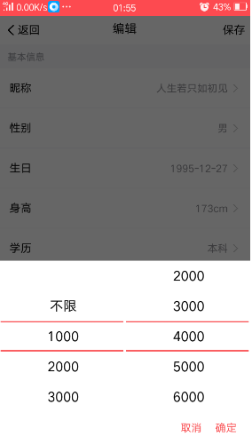
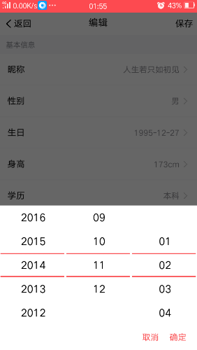
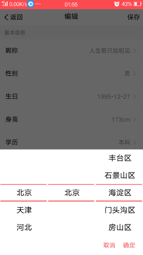
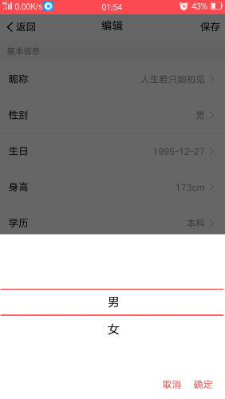

# weex-x-picker

weex-x-picker 支持 single(单选)，area(区域)，section(区间)，date(日期)，time(时间), linkage(联动)。

weex-x-picker 基于 alibaba 的weex-ui中的wxc-popup，wxc-overlay 组件开发， 感谢weex-ui的开发团队辛苦开源weex-ui。

# x-picker
用于选择器，包括单选，选择区间，时间，日期，区域等。

## 安装

``` sh
npm add weex-x-picker
```











## 使用方法

``` js
<template>
  <div class="wrapper">
    <text @click="openPicker">打开picker</text>

    <x-picker :type="pickerType"
              :show="showPicker"
              :dataset="list"
              :defaultTitle="defaultTitle"
              @overlayClick="pickerOverlayClick"
              @onchange="change" />
  </div>
</template>

<script>

  import { XPicker } from 'weex-x-picker';

  export default {
    components: { XPicker },
    data: () => ({

      pickerType: 'single',

      showPicker: false,

      list: [
        { title: '金星' },
        { title: '木星' },
        { title: '水星' },
        { title: '火星' },
        { title: '地球' },
        { title: '天王星' },
        { title: '海王星' },
        { title: '冥王星' },
        { title: '哈雷彗星' },
      ],

      defaultTitle : '地球'

    }),
    methods: {
      openPicker () {
        this.showPicker = true;
      },
      pickerOverlayClick (e) {
        this.showPicker = false;
      },
      change (e) {
        console.log(e)
      }
    }
  }

</script>

<style scoped>

  .wrapper {
    padding-top: 100px;
  }

</style>
```

## 可配置参数
|Prop|Type|Required|Default|Desc|
|---|---|---|---|---|
|show|`Boolean`|`Y`| `false` |控制选择器是否显示|
|type|`String`|`Y`| `'single'` |选择器的类型，详细配置参考下方 `type规则`|
|defaultTitle|`String`|`N`| `null` |选择器的默认值标题，如果是多列用空格隔开，默认值必须是选择器中的选项，否则匹配不到不生效。|
|dataset|`Array`|Y| `[]` |选择器的数据集合。当type为section时，数据集的格式需要规定为[ [...], [...] ]，，详细配置参考下方 `dataset规则`|
|yearSection|`Array`|`N`| `[1949, new Date().getFullYear()]` |年份的区间，该参数只有才type为date时，才生效。用于规定日期的年份区间|
|linkageColumn|`Number`|N| `2` |联动的列数，该参数只有在type为linkage时，才生效。用于自定义联动的数据的列。（注：动态修改时，需要先将类型修改为linkage，在修改该值）|


### type 规则

| Value   |DefaultColumn| Desc                              |
| ------- | --- | --------------------------------- |
| single  |`1`| 单选选择器                        |
| area    |`3`| 区域选择器                        |
| section |`2`| 区间选择器                        |
| date    |`3`| 日期选择器                        |
| time    |`2`| 时间选择器                        |
| linkage |`2`| 联动选择器 (自定义列数联动选择器) |

### dataset 规则

dataset默认的数据结构规则为: 

``` js
{ 
    title: '...', 
    value: '', 
    children: [{title: '...', value: ''}, ...]
}
```

如果需要指定联动的下一级，将数据放到`children`属性中。

如果结构中没有value时，默认返回的value为title。


type 为 section时：

dataset的数据结构应为：

```js
[
    [{title: '...', value: ''}, ...],			// 第一列
    [{title: '...', value: ''}, ...]			// 第二列
]
```


type 为 date，time时，dataset无效。


type为 area时，可以使用默认的区域数据，或者遵循dataset的数据结构自定义数据。

> type为 area时, 如要使用默认区域数据，需要不指定dataset，或者dataset 为[], 或者null。


## Single (单选)

``` js
<template>
  <div class="wrapper">
    <text @click="openPicker">打开picker</text>

    <x-picker :type="pickerType"
              :show="showPicker"
              :dataset="list"
              :defaultTitle="defaultTitle"
              @overlayClick="pickerOverlayClick"
              @onchange="change" />
  </div>
</template>

<script>

  import { XPicker } from 'weex-x-picker';

  export default {
    components: { XPicker },
    data: () => ({

      pickerType: 'single',

      showPicker: false,

      list: [
        { title: '金星' },
        { title: '木星' },
        { title: '水星' },
        { title: '火星' },
        { title: '地球' },
        { title: '天王星' },
        { title: '海王星' },
        { title: '冥王星' },
        { title: '哈雷彗星' },
      ],

      defaultTitle : '地球'

    }),
    methods: {
      openPicker () {
        this.showPicker = true;
      },
      pickerOverlayClick (e) {
        this.showPicker = false;
      },
      change (e) {
        console.log(e)
      }
    }
  }

</script>

<style scoped>

  .wrapper {
    padding-top: 100px;
  }

</style>
```


## Area (区域)

``` js
<template>
  <div class="wrapper">
    <text @click="openPicker">打开picker</text>

    <x-picker type="area"
              :show="showPicker"
              :defaultTitle="defaultTitle"
              @overlayClick="pickerOverlayClick"
              @onchange="change" />
  </div>
</template>

<script>

  import { XPicker } from 'weex-x-picker';

  export default {
    components: { XPicker },
    data: () => ({

      showPicker: false,

      defaultTitle : '北京 北京 东城区'

    }),
    methods: {
      openPicker () {
        this.showPicker = true;
      },
      pickerOverlayClick (e) {
        this.showPicker = false;
      },
      change (e) {
        console.log(e)
      }
    }
  }

</script>

<style scoped>

  .wrapper {
    padding-top: 100px;
  }

</style>
```


## Date (日期)

``` js
<template>
  <div class="wrapper">
    <text @click="openPicker">打开picker</text>

    <x-picker type="date"
              :show="showPicker"
              :defaultTitle="defaultTitle"
              @overlayClick="pickerOverlayClick"
              @onchange="change" />
  </div>
</template>

<script>

  import { XPicker } from 'weex-x-picker';

  export default {
    components: { XPicker },
    data: () => ({

      showPicker: false,

      defaultTitle : '2014 11 02'

    }),
    methods: {
      openPicker () {
        this.showPicker = true;
      },
      pickerOverlayClick (e) {
        this.showPicker = false;
      },
      change (e) {
        console.log(e)
      }
    }
  }

</script>

<style scoped>

  .wrapper {
    padding-top: 100px;
  }

</style>
```


## Time (时间)

``` js
<template>
  <div class="wrapper">
    <text @click="openPicker">打开picker</text>

    <x-picker type="time"
              :show="showPicker"
              :defaultTitle="defaultTitle"
              @overlayClick="pickerOverlayClick"
              @onchange="change" />
  </div>
</template>

<script>

  import { XPicker } from 'weex-x-picker';

  export default {
    components: { XPicker },
    data: () => ({

      showPicker: false,

      defaultTitle : '23 59'

    }),
    methods: {
      openPicker () {
        this.showPicker = true;
      },
      pickerOverlayClick (e) {
        this.showPicker = false;
      },
      change (e) {
        console.log(e)
      }
    }
  }

</script>

<style scoped>

  .wrapper {
    padding-top: 100px;
  }

</style>
```


## section (区间)

``` js
<template>
  <div class="wrapper">
    <text @click="openPicker">打开picker</text>

    <x-picker type="section"
              :show="showPicker"
              :dataset="list"
              :defaultTitle="defaultTitle"
              @overlayClick="pickerOverlayClick"
              @onchange="change" />
  </div>
</template>

<script>

  import { XPicker } from 'weex-x-picker';

  export default {
    components: { XPicker },
    data: () => ({

      pickerType: 'single',

      showPicker: false,

      list: [
        [
            { title: '金星' },
            { title: '木星' },
            { title: '水星' },
            { title: '火星' },
            { title: '地球' },
            { title: '天王星' },
            { title: '海王星' },
            { title: '冥王星' },
            { title: '哈雷彗星' },
        ],
        [
            { title: '金星' },
            { title: '木星' },
            { title: '水星' },
            { title: '火星' },
            { title: '地球' },
            { title: '天王星' },
            { title: '海王星' },
            { title: '冥王星' },
            { title: '哈雷彗星' },
          ]  
      ],

      defaultTitle : '水星 地球'

    }),
    methods: {
      openPicker () {
        this.showPicker = true;
      },
      pickerOverlayClick (e) {
        this.showPicker = false;
      },
      change (e) {
        console.log(e)
      }
    }
  }

</script>

<style scoped>

  .wrapper {
    padding-top: 100px;
  }

</style>
```
